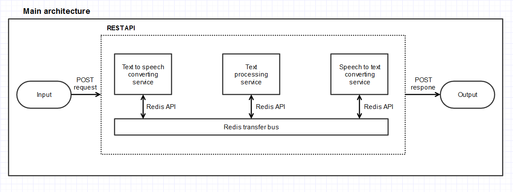
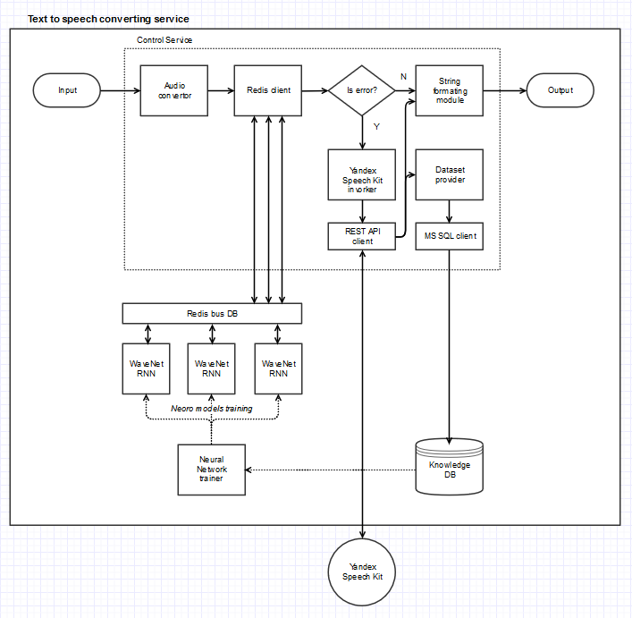
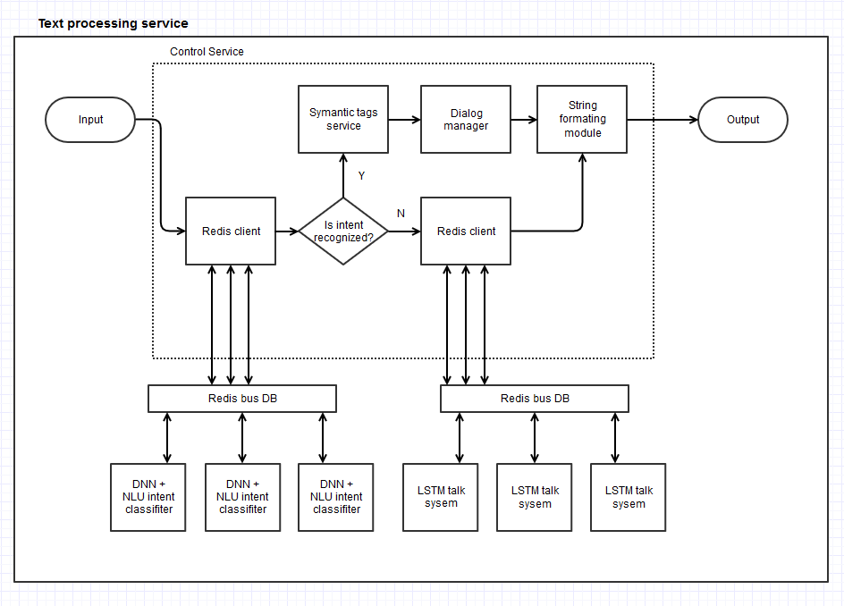
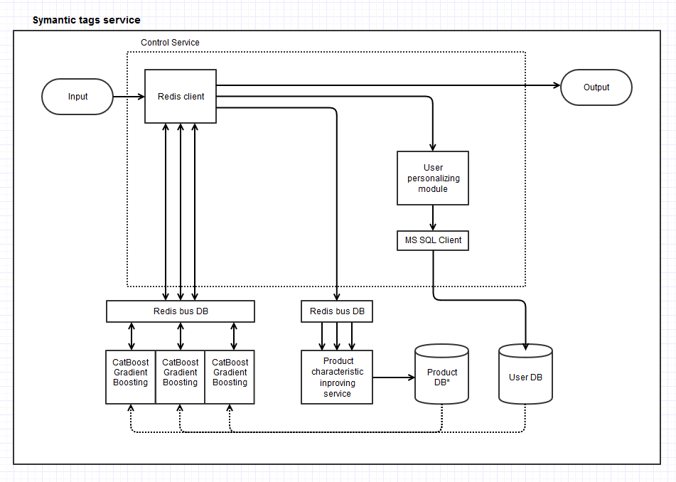
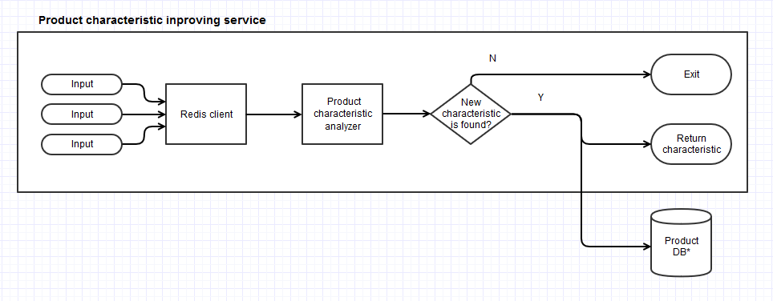
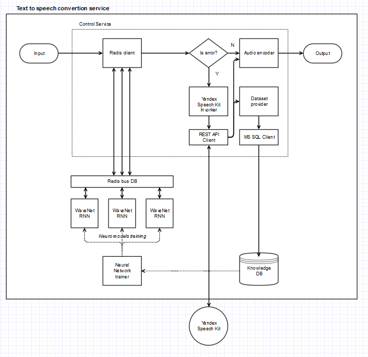

# Venus.AI
It tis a powerfuul open source AI freamwork like Dialog Flow, LUIS. It contains *Web API*, *Telegram Bot Client* and *Console Bot client*.

The Project is developing now. You may join us! Please write to gosha20777@live.ru to contact.

### Documentation
#### Project architecture
The project has a micro service architecture. The scheme of the project is shown below.













#### API usage

you should send a post request to http://192.168.88.150:50567/api/request end point.

Post rquest:
```json
{
	"id":"<user id in database, long>",
	"requestType":"<type of input message, [text, voice]>",
	"voiceData":"<byte array or WAW PCM mino 1600 Hz sound (for voice messages)>",
	"textData":"<string, (for text messages)>",
	"language":"<type of language, [rus, eng]>"
}
``` 
Post respone:
```json
{
	"id":         "<user id in database, long>",
	"voiceData":  "<byte array or WAW PCM mino 1600 Hz sound (for voice messages)>",
	"outputText": "<string, text answer>",
	"intentName": "string, name of user intent accoding to trained model",
	"entities":   
		{
			"entity_name1": "entity_value1",
			"entity_name2": "entity_value2"
			...
		}
}
``` 
